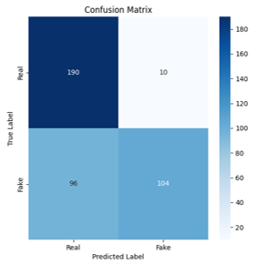
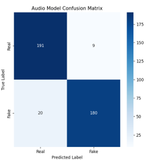
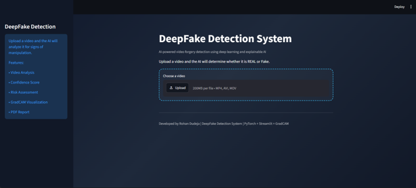
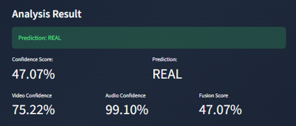
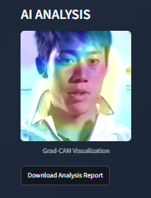

# Multimodal Deepfake Detection System

## Overview

The Multimodal Deepfake Detection System is an AI-based solution designed to detect manipulated media by combining visual and audio analysis. The system leverages deep learning techniques to identify DeepFake content in videos and audio recordings, improving reliability over single-modality approaches.

## Features

* Visual Deepfake Detection using ResNet18
* Audio Deepfake Detection using MFCC Features
* Grad-CAM Explainability for model interpretation
* Confidence Score Visualization
* Streamlit-based User Interface
* Real-time media upload and prediction

---

## Technologies Used

* Python
* PyTorch
* OpenCV
* Streamlit
* NumPy
* Scikit-Learn
* Torchvision
* Matplotlib

---

## Dataset

**Dataset:** FakeAVCeleb

The dataset contains both real and manipulated video/audio samples used for training and evaluating multimodal Deepfake detection models.

---

## Project Workflow

1. Data Collection and Preparation
2. Video Frame Extraction
3. Audio Feature Extraction using MFCC
4. Data Preprocessing and Augmentation
5. Model Training
6. Performance Evaluation
7. Grad-CAM Explainability
8. Streamlit Deployment

---

## Visual Deepfake Detection Model

### Architecture

* ResNet18 (Transfer Learning)
* Input Size: 224 × 224
* Optimizer: Adam
* Learning Rate: 0.0001
* Epochs: 20

### Performance Metrics

| Metric    | Value  |
| --------- | ------ |
| Accuracy  | 73.50% |
| Precision | 91.23% |
| Recall    | 52.00% |
| F1-Score  | 66.24% |

### Video Model Confusion Matrix

---

## Audio Deepfake Detection Model

### Methodology

* MFCC Feature Extraction
* Deep Learning-based Audio Classification

### Performance Metrics

| Metric    | Value  |
| --------- | ------ |
| Accuracy  | 92.75% |
| Precision | 95.24% |
| Recall    | 90.00% |
| F1-Score  | 92.54% |

### Audio Model Confusion Matrix

---

## Application Screenshots

### Streamlit Interface

### Prediction Results

### Grad-CAM Explainability

---

## Explainable AI using Grad-CAM

Grad-CAM (Gradient-weighted Class Activation Mapping) was integrated to visualize the image regions influencing model predictions. This improves transparency and interpretability by highlighting the areas the model focuses on when classifying media as real or fake.

---

## Key Achievements

* Developed a multimodal Deepfake detection framework combining visual and audio analysis.
* Achieved 73.5% visual classification accuracy with 91.23% precision.
* Achieved 92.75% audio classification accuracy with 92.54% F1-score.
* Implemented Grad-CAM explainability for model interpretation.
* Built an interactive Streamlit application for real-time Deepfake detection.

---

## Future Improvements

* Transformer-based architectures for enhanced performance.
* Advanced multimodal feature fusion techniques.
* Real-time video stream analysis.
* Deployment on cloud platforms for scalability.

---

## Author

Rohan Dudeja

B.Tech (Artificial Intelligence & Machine Learning)

Guru Jambheshwar University of Science and Technology, Hisar
